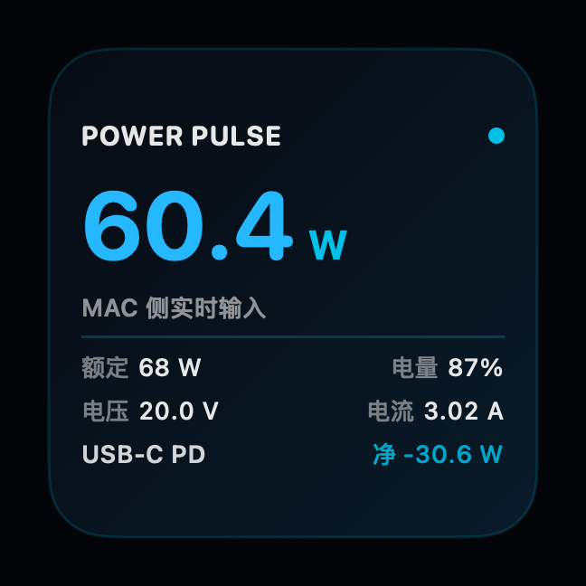
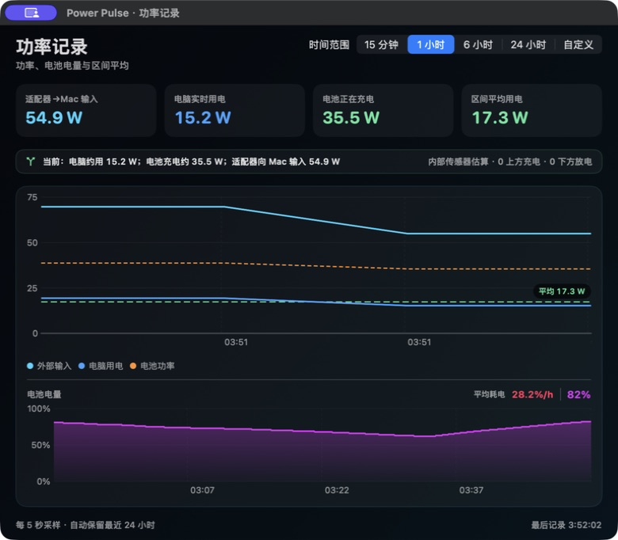

# Power Pulse

<p align="center">
  
</p>

Power Pulse 是一个 macOS 原生供电监控工具，包含真正的 WidgetKit 桌面小组件、实时菜单栏读数和最近 24 小时的功率历史。接通电源时显示适配器向 Mac 输入的功率，使用电池时自动切换为电脑实时用电。桌面组件使用系统网格占位，Finder 桌面文件不会与它重叠；菜单栏通过 IOKit 每 5 秒读取并记录一次本机功率与电量。

## 主要功能

- 真正的 WidgetKit 桌面小组件：占用系统组件网格，不置顶，也不覆盖 Finder 桌面文件。
- 菜单栏实时读数：接电显示适配器→Mac 输入，电池供电显示电脑实时用电。
- 供电详情：额定功率、USB-C PD 合约、电压、电流、电量和电池充/放电功率。
- 历史曲线：同步记录适配器输入、电脑用电、电池功率与电量百分比，保留最近 24 小时。
- 清晰的功率流：直接写明电脑用了多少、电池在充电还是放电，以及适配器向 Mac 输入多少。
- 区间统计：显示区间平均电脑用电和平均每小时耗电百分比，支持 15 分钟、1 小时、6 小时、24 小时及自定义窗口。
- 完全本地运行：不需要 sudo、网络账户或后台上传。

## 界面

### 桌面小组件

<p align="center">
  
</p>

### 功率与电量历史

<p align="center">
  
</p>

截图均由 Power Pulse 使用当前机器的真实 IOKit 遥测生成；功率、电量、电压和电流会随机器状态变化。

## 实现方式与取舍

- WidgetKit 提供真正的桌面占位、拖放和系统编辑体验，但刷新频率由 macOS 调度，不能保证秒级更新。
- 菜单栏由宿主 App 每 5 秒读取一次 IOKit：接电显示输入功率，电池供电显示电脑用电估算。
- 菜单栏中的“打开功率曲线…”记录功率和电池电量，提供区间平均、自定义 1 分钟至 24 小时窗口与最近 24 小时本地历史。
- 不再使用自定义桌面窗口，因此不会置顶，也不会与 Finder 文件争抢位置。
- 运行时不需要 Homebrew、Node、sudo 或网络。

## 构建与启动

```sh
cd power-pulse
./build.sh
open "dist/Power Pulse.app"
```

启动后，在桌面空白处右键，选择“编辑小组件”，搜索 `Power Pulse`，把小号组件拖到桌面。点击菜单栏实时瓦数可查看添加说明、暂停刷新或退出。重启 Mac 后需要再次打开 App。

## 功率曲线

点击菜单栏中的 Power Pulse 瓦数，再选择“打开功率曲线…”。顶部卡片明确区分“适配器→Mac 输入”“电脑实时用电”和“电池正在充电/放电”；下方一句话直接写明当前功率流，不需要自己根据正负号推算。电池功率曲线以零线区分方向：零线上方表示充电，零线下方表示放电。

曲线复用菜单栏的 5 秒采样，不会额外轮询硬件；功率与电池电量百分比同步记录，自动保留最近 24 小时，跨应用重启继续记录。电量曲线的“平均耗电”按电池供电时段的净电量下降百分点除以时长计算，充电时段不计入。除 15 分钟、1 小时、6 小时和 24 小时预设外，也可自定义最近 1 分钟至 24 小时的窗口，所有曲线和平均指标会同步重算。

历史数据保存在 App 沙盒的 `Library/Application Support/Power Pulse/power-history.jsonl`，不需要网络，也不会上传。1.7 之前按 `SystemLoad` 记录的功率样本不会参与新版功率曲线和平均值，原有电量百分比记录仍会保留。

## 指标边界

- “适配器→Mac 输入”来自私有 IOKit 字段 `PowerTelemetryData.SystemPowerIn`，单位由输入电压 × 输入电流交叉校验。它包含电脑当时使用的电力和送往电池充电路径的电力。
- “电脑实时用电”优先来自 `PowerTelemetryData.SystemEnergyConsumed`。尽管字段名含 `Energy`，本机连续样本与其累计值变化表明当前值以 mW 表示功率；因此这里仍标为内部遥测估算。
- “电池功率”由电池端 `Voltage × (InstantAmperage / Amperage)` 计算；正值表示充电，负值表示放电。各传感器并非完全同步，适配器输入、电脑用电与电池功率可能有少量瞬时差额。
- 私有字段 `PowerTelemetryData.SystemLoad` 不再作为“整机功耗”：在实机充电状态下它可明显大于适配器输入，并不符合可直接展示为当前电脑用电的口径。
- 额定功率优先来自公开 API `IOPSCopyExternalPowerAdapterDetails()`。
- 协议只显示本机能可靠确认的 `USB-C PD` 与当前合约档位，不臆测具体 PD 修订版。
- Mac 读到的是适配器到电脑的直流侧输入，并非插座交流侧电表实测值；若需要真正的“墙端功率”，仍需智能插座或外置功率计。

## License

[MIT](LICENSE)
